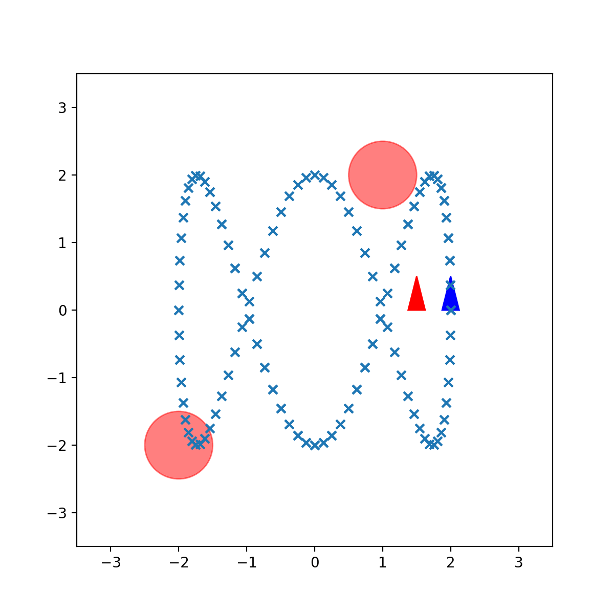

# UCSD ECE276B PR3

## Overview
In this assignment, you will implement a controller for a car robot to track a trajectory.

|           CEC without Noise            |
| :-------------------------------------: |
|  |

## Vanilla Simple Controller
```shell
python main.py --control_method simple

```
##  CEC Controller
```shell
python main.py --control_method cec

```
## GPI  
```shell
python main.py --control_method simple

```